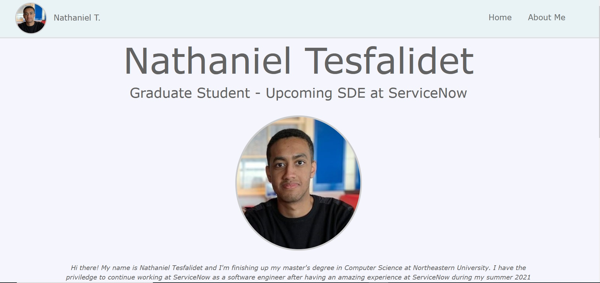
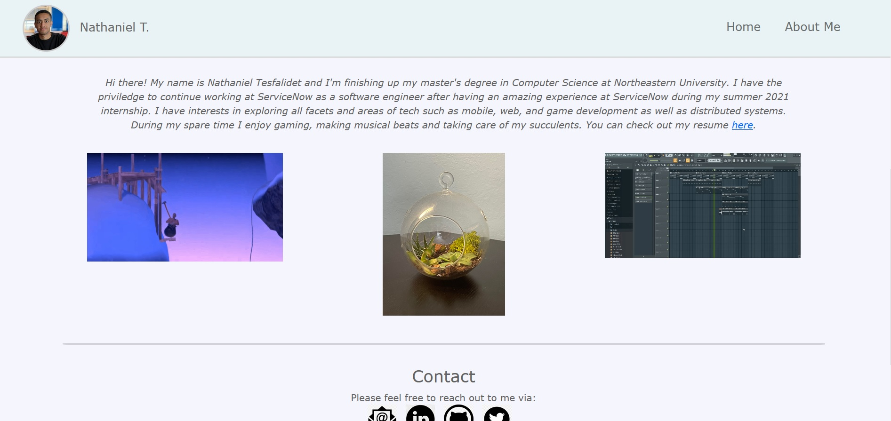
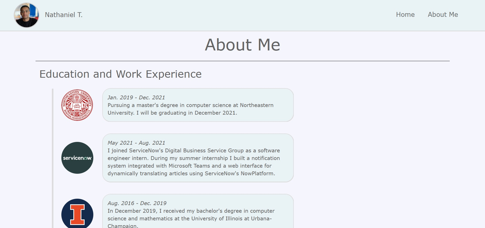
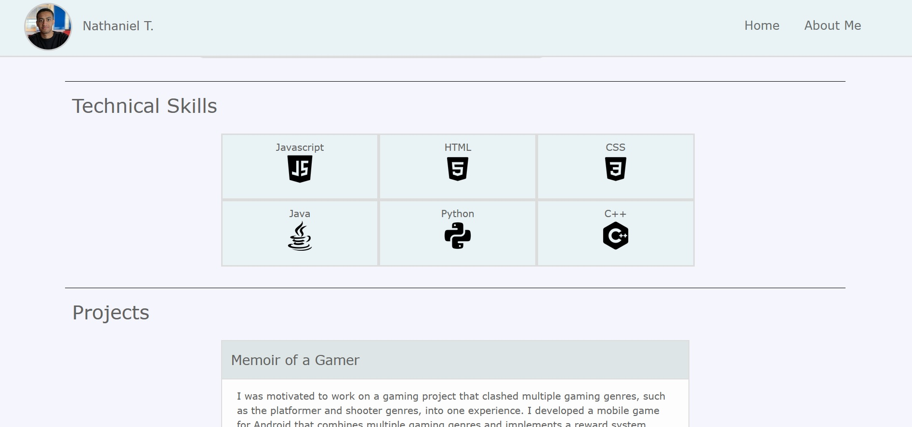

# My-Personal-Homepage

This repository serves as my personal website (Project 1) for the CS5610 Web Development Course.

## Project Objective

The objective of this project is to create a personal website that serves as a portfolio highlighting essential aspects of myself including my education and work experience, technical skills, and projects. This project utilizes HTML, CSS, JavaScript (ES6) and Bootstrap for implementing my personal website. This project is configured with eslint and the html files, `index.html` and `aboutme.html`, are W3C compliant.

## Author

Nathaniel Tesfalidet

## Relevant Links

- [Class website link](https://johnguerra.co/classes/webDevelopment_fall_2021/)
- [Video demo link](https://drive.google.com/file/d/10wYanR28T_cvgnbOFD4yKnuODDYRtgr4/view?usp=sharing)
- [Google slides link](https://docs.google.com/presentation/d/1KToaGHwro3H3Q7QaXnYNbm9zX9lNC_8Ws7Ro-SBdnvY/edit?usp=sharing)

## Instructions

### Installation Requirements:

- Make sure to have Node.js and npm installed. You can do so by running `npm install -g npm` in the command line.
- Install `http-server` dependency if you want to run the project locally through `http-server`. You can do so by running `npm install -g http-server` in the command line.
- Alternatively, you can install `reload` dependency if you want to run the project locally through `reload`. You can do so by running `npm install -g --save-dev reload` in the command line.

### How to run project locally:

- To run the project locally through `http-server` simply run `http-server .` in the root of the project folder through the command line.
- Alternatively, to run the project locally through `reload` simply run `reload -b` in the root of the project folder through the command line.

## Screenshots

